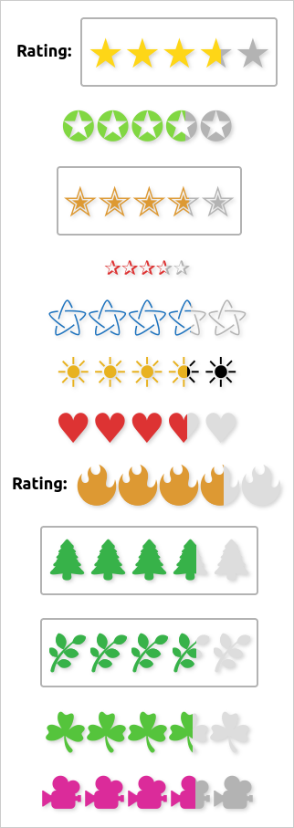
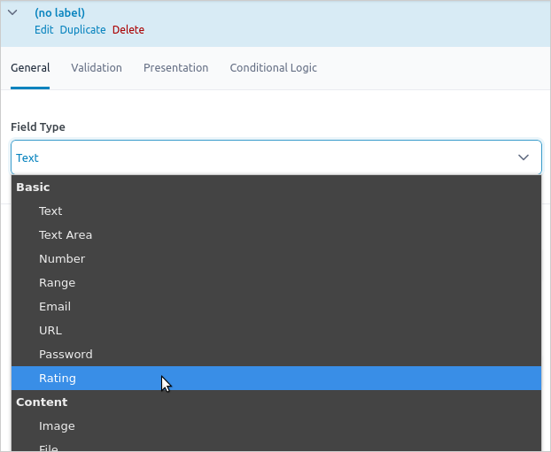
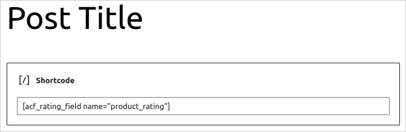

# ACF Rating Field

ACF Rating Field is a WordPress plugin that adds a new field type to ACF, allowing you to manage ratings with decimal values. ACF (Advanced Custom Fields) is a popular WordPress plugin that enables developers to add custom fields to posts, pages, and other content types. By default, the rating field uses a star ("★") symbol, but this can be customized to suit your needs.

Here are examples of how a rating of 3.6 out of 5 can be rendered:



## Installation

* Download the [latest version on GitHub](https://github.com/jpfleury/acf-rating-field/releases/latest/download/acf-rating-field.zip).

* Extract the archive and copy the folder (`acf-rating-field`) to the WordPress plugins directory (`/wp-content/plugins/`).

* Go to the WordPress Plugins page on your website (`your-website.ext/wp-admin/plugins.php`) and activate the **ACF Rating Field** plugin.

	**You can also enable auto-updates.**

## Usage

### Admin

Go to the ACF field groups page (`your-website.ext/wp-admin/edit.php?post_type=acf-field-group`), add a new field group, and choose the field type **Rating**:



Adjust the field settings as needed.

### Front-end

To display the field value, you can use the `acf_rating_field` shortcode. By default, it retrieves the custom field value for the current post. For example, the following shortcode:

```
[acf_rating_field name="FIELD_NAME"]
```

is equivalent to:

```
[acf_rating_field name="FIELD_NAME" type="post"]
```



To get the field value from another post, use the `id` attribute:

```
[acf_rating_field name="FIELD_NAME" id="POST_ID"]
```

If the rating field is linked to a comment, set the `type` to `comment`. By default, it will look at the current comment:

```
[acf_rating_field name="FIELD_NAME" type="comment"]
```

To specify a specific comment, use the `id` attribute:

```
[acf_rating_field name="FIELD_NAME" type="comment" id="COMMENT_ID"]
```

If the rating field is linked to a user, set the `type` to `user`. By default, it will use the current user:

```
[acf_rating_field name="FIELD_NAME" type="user"]
```

To target a specific user, set the `id` attribute:

```
[acf_rating_field name="FIELD_NAME" type="user" id="USER_ID"]
```

#### Displaying a custom value

Use the `value` attribute to display a custom rating, either standalone or based on the styling of a specific field. If both `value` and `name` are provided, the style of the named field will be used:

```
[acf_rating_field name="FIELD_NAME" value="3.6"]
```

To set the rating style manually, use the `style` attribute. Available styles are `custom` and `simple`:

```
[acf_rating_field style="simple" value="3.6"]
```

## License

**ACF Rating Field**: Rating field for ACF supporting decimal numbers and a custom symbol  
Copyright © 2022-2025 Jean-Philippe Fleury <https://github.com/jpfleury>

This program is free software: you can redistribute it and/or modify
it under the terms of the GNU General Public License as published by
the Free Software Foundation, either version 3 of the License, or
(at your option) any later version.

This program is distributed in the hope that it will be useful,
but WITHOUT ANY WARRANTY; without even the implied warranty of
MERCHANTABILITY or FITNESS FOR A PARTICULAR PURPOSE.  See the
GNU General Public License for more details.

You should have received a copy of the GNU General Public License
along with this program.  If not, see <https://www.gnu.org/licenses/>.

### Third-party code

* [Plugin Update Checker](https://github.com/YahnisElsts/plugin-update-checker), under the [MIT License](https://github.com/YahnisElsts/plugin-update-checker/blob/master/license.txt), is used to manage auto-updates in the WordPress plugin admin page.

* Thanks to [ACF Example Field Type](https://github.com/AdvancedCustomFields/acf-example-field-type) for template reference.
